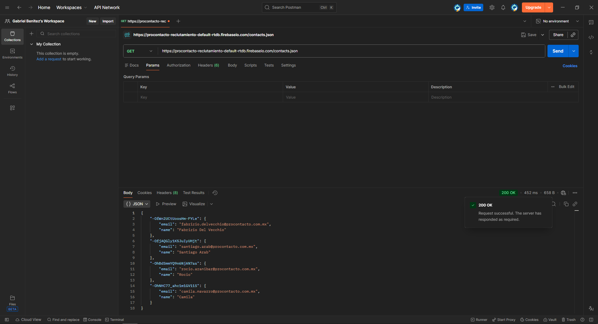
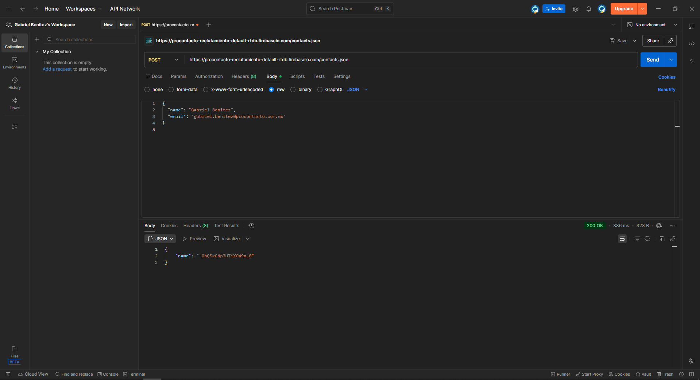
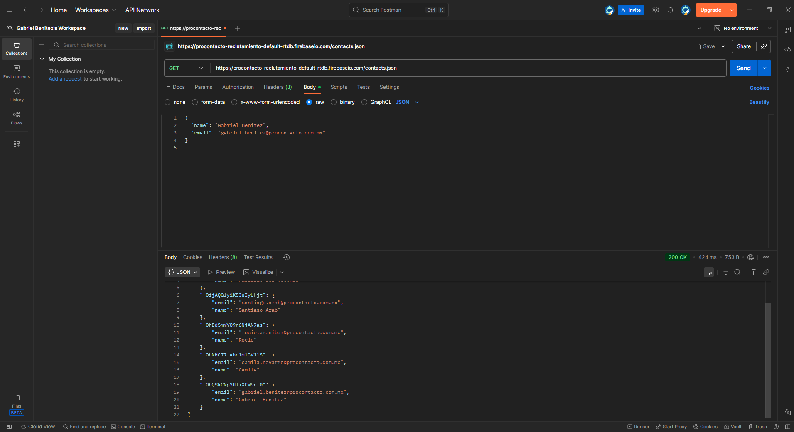
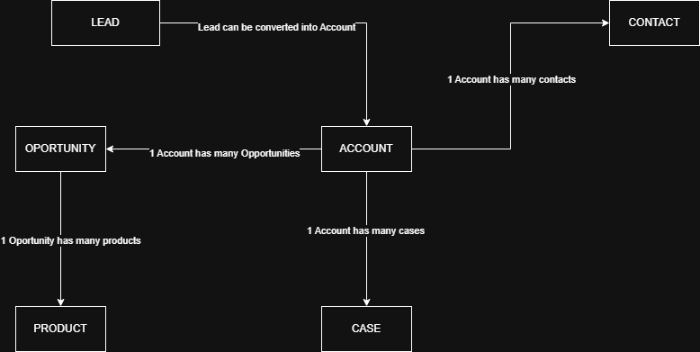

# Salesforce Technical Test – PMO

## Overview
This repository contains the resolution of the technical assessment for ProContacto.
The objective of this test is to demonstrate conceptual understanding of Salesforce,
basic HTTP knowledge, and the ability to document technical processes clearly,
with a PMO-oriented approach.

## Exercises
The following sections describe each exercise and its resolution.

---

## Exercise 1 – Environment Setup
Visual Studio Code and Git were installed successfully in order to work with the repository and documentation.

---

## Exercise 2 – HTTP Concepts

### 1. What is an HTTP server?
An HTTP server is a system that receives requests from clients (such as browsers or applications) and responds using the HTTP protocol by returning the requested resources or data.

### 2. What are HTTP verbs? Mention the most common ones
HTTP verbs define the action to be performed on a resource.
The most common ones are:
- GET: retrieve information
- POST: send or create information
- PUT: update information
- DELETE: remove information

### 3. What is a request and a response? What are headers?
A request is the message sent by the client to the server.
A response is the message sent back by the server after processing the request.

Headers contain metadata about the communication, such as content type or authentication details.

### 4. What is a query string?
A query string is additional information sent in the URL as key–value pairs after the `?` symbol.

Example:
`/users?id=10&status=active`

### 5. What is a response code?
A response code is a numeric value that indicates the result of an HTTP request.

Examples:
- 200: successful request
- 404: resource not found
- 500: internal server error

### 6. How is data sent in a GET request and in a POST request?
In a GET request, data is sent through the URL as a query string.
In a POST request, data is sent in the body of the request.

### 7. Which HTTP verb does a browser use when accessing a web page?
Browsers generally use the GET verb to request web pages.

### 8. What are JSON and XML?
JSON and XML are data exchange formats.

JSON example:
{
  "name": "Juan",
  "email": "juan@mail.com"
}

XML example:
<user>
  <name>Juan</name>
  <email>juan@mail.com</email>
</user>

### 9. What is SOAP?
SOAP is a communication standard based on XML, commonly used in traditional enterprise systems and characterized by a strict structure.

### 10. What is REST?
REST is an architectural style for web services that uses HTTP, standard HTTP verbs and commonly JSON to exchange data in a simple and flexible way.

### 11. What are headers in a request? What is the Content-Type header used for?
Headers provide additional information about the request.
The Content-Type header specifies the format of the data being sent, such as application/json.

## Exercise 3 – Postman Requests
Three HTTP requests were executed using Postman in order to interact with the provided endpoint.

### GET request
A GET request was sent to retrieve the existing contacts stored in the service.

- Method: GET  
- URL: https://procontacto-reclutamiento-default-rtdb.firebaseio.com/contacts.json  

The response returned a JSON object containing the list of stored contacts.

### POST request
A POST request was sent to create a new contact.

- Method: POST  
- URL: https://procontacto-reclutamiento-default-rtdb.firebaseio.com/contacts.json  

Request body:
{
  "name": "Gabriel Benitez",
  "email": "gabriel.benitez@procontacto.com.mx"
}
The response returned a unique identifier for the newly created record.

### GET request (verification)
A final GET request was executed to verify that the new contact was successfully stored.

The response confirmed that the newly created record appears in the list of contacts.

---

## Exercise 4 – Trailhead Modules

All the requested Trailhead modules were completed using the same Playground, with the platform language set to English, as required.

Completed modules:
- Salesforce Platform Fundamentals
- Apex and .NET Fundamentals
- Data Modeling
- Apex Fundamentals and Database
- Apex Triggers
- Apex Integration Services

Trailhead public profile:
https://www.salesforce.com/trailblazer/gabrielben

---

## Exercise 5 – Salesforce Objects and Relationships

Salesforce data is organized using standard objects that represent real business entities.
The following section describes the main objects involved in a typical sales and service process and how they relate to each other.

### Main Objects

- Lead: Represents a potential customer who has not yet been qualified.
- Account: Represents a company or customer organization.
- Contact: Represents a person associated with an Account.
- Opportunity: Represents a potential sales deal linked to an Account.
- Case: Represents a customer support request.
- Product: Represents a product or service offered by the company.

### Relationships Overview

- A Lead can be converted into an Account, Contact and Opportunity.
- An Account can have multiple Contacts and Opportunities.
- An Opportunity belongs to one Account and may include Products.
- A Case is linked to an Account and optionally to a Contact.

These relationships allow Salesforce to track the full customer lifecycle, from initial contact to sales and post-sale support.

---

## Exercise 6 – Salesforce Concepts

### Salesforce Solutions

A. What is Salesforce?  
Salesforce is a cloud-based SaaS platform used to manage customer relationships, business processes and data across sales, service and marketing.

B. What is Sales Cloud?  
Sales Cloud is a Salesforce solution focused on managing leads, opportunities, accounts and the sales pipeline.

C. What is Service Cloud?  
Service Cloud is a solution designed to manage customer support, cases, and service channels.

D. What is Health Cloud?  
Health Cloud is a Salesforce solution tailored for the healthcare industry, focused on patient data and care processes.

E. What is Marketing Cloud?  
Marketing Cloud is used to manage marketing campaigns, automation and customer communications.

---

### Salesforce Functionalities

A. What is a Record Type?  
A Record Type allows different business processes, layouts and picklist values for the same object.

B. What is a Report Type?  
A Report Type defines which records and related objects are available in a report.

C. What is a Page Layout?  
A Page Layout controls the visual layout of fields and sections in a record.

D. What is a Compact Layout?  
A Compact Layout defines the key fields shown in highlights and mobile views.

E. What is a Profile?  
A Profile defines user permissions, access to objects, fields and functionalities.

F. What is a Role?  
A Role defines data visibility and hierarchy between users.

G. What is a Validation Rule?  
A Validation Rule prevents saving incorrect or incomplete data.

H. What is a Sandbox?  
A Sandbox is a testing environment used to validate changes before production.

I. Difference between Master-Detail and Lookup relationships?  
Master-Detail is a dependent relationship where the child depends on the parent.  
Lookup is a flexible relationship where records can exist independently.

J. What is a Change Set?  
A Change Set is used to deploy configuration changes between Salesforce environments.

K. What is the Import Wizard used for?  
It is used to import data into Salesforce using guided steps.

L. What is Web to Lead used for?  
It captures leads from web forms directly into Salesforce.

M. What is Web to Case used for?  
It creates support cases from web forms.

N. What is Omnichannel used for?  
It routes work items across multiple service channels efficiently.

O. What is Chatter used for?  
It enables internal collaboration and communication between users.

---

### General Concepts

A. What does SaaS mean?  
Software delivered as a service over the internet.

B. Is Salesforce SaaS?  
Yes, Salesforce is a SaaS platform.

C. What does Cloud mean?  
Applications and data hosted on remote servers accessed via internet.

D. What does On-Premise mean?  
Software installed and maintained on local servers.

E. What is a sales pipeline?  
A visual representation of sales opportunities by stage.

F. What is a sales funnel?  
A model that represents the customer journey from leads to closed deals.

G. What is Customer Experience (CX)?  
The overall experience a customer has with a company.

H. What does omnichannel mean?  
Providing a unified experience across multiple communication channels.

I. What is B2B, B2C and a KPI?  
B2B: Business to Business.  
B2C: Business to Consumer.  
KPI: Key Performance Indicator used to measure performance.

J. What is an API and how is it different from a REST API?  
An API enables system communication. REST API is a type of API using HTTP and REST principles.

K. What is a Batch Process?  
A process that executes large volumes of data asynchronously.

L. What is Kanban?  
A visual workflow management method.

M. What is an ERP?  
A system that manages core business processes such as finance and inventory.

N. Is Salesforce an ERP?  
No, Salesforce is not an ERP, but it can integrate with ERP systems.

---

## Exercise 7 – Apex Trigger (Conceptual Approach)
(This exercise is explained from a conceptual point of view, aligned with a PMO role.)
